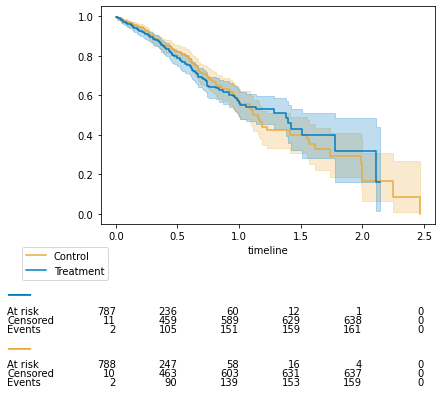
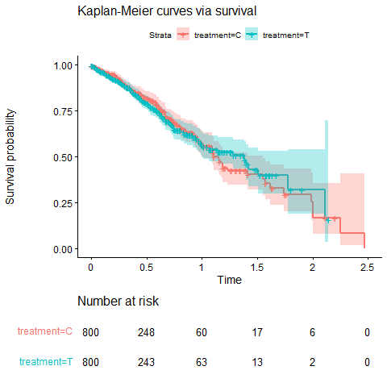
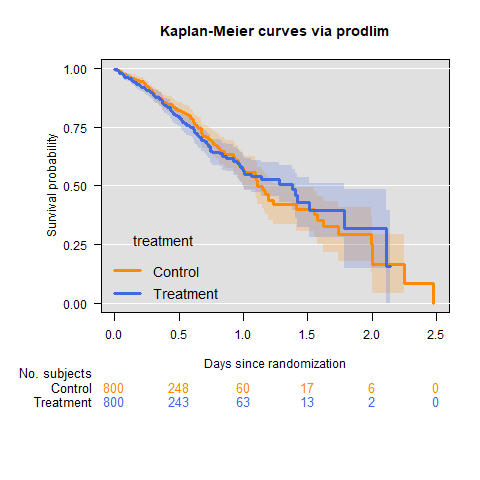
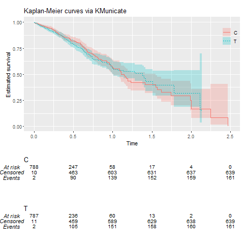

# Notes on survival curves

In this section a comparison of R versus Python survival curves display is documented.

## Event tables and survival curves

The [`lifelines`](https://pypi.org/project/lifelines/) package is used to compute survival curves such as the one pictured below for a time-to-event outcome.

## Differences between R and Python

Events tables and survival curves are identical in R and Python. However, the numbers at risk displayed at certain times may differ for two reasons:

1. The numbers at risk displayed can be calculated at the start of the period defined by the x-axis tick, or at the end. An option exists in lifelines ([see here](https://github.com/CamDavidsonPilon/lifelines/issues/1383)) to display numbers at risk at the start (left) or end of period (right).

### Comparison with R packages

The `survival` and `prodlim` packages display numbers at risk at the _start_ of period, while the `KMunicate` package display number at risk at the _end_ of period. 

The `lifelines` option will thus be set to "start of the period" by default, to align with `survival` and `prodlim`  outputs.

1. The numbers at risk displayed at a time tick not found in the survival tables are handled differently in R and Python. As shown in the survival figures and table belows for __Time = 1.5__, Python displays the numbers "right before" the missing tick (number at risk = 19 for control), while R displays the numbers "right after" (number at risk = 17 for control).

The `gpc_library` core code was modified to account for this difference, and to align with `survival` and `prodlim` outputs, as shown below.

